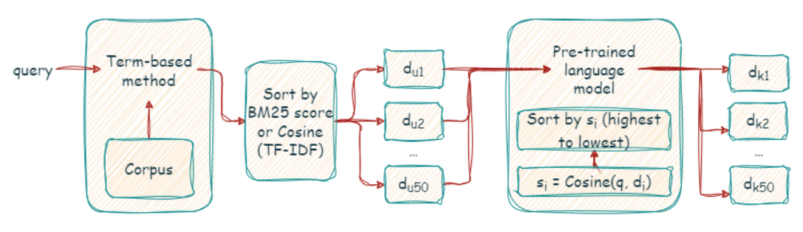
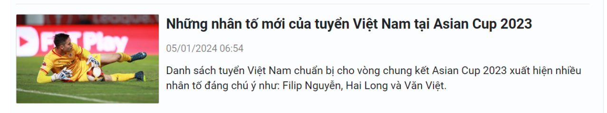
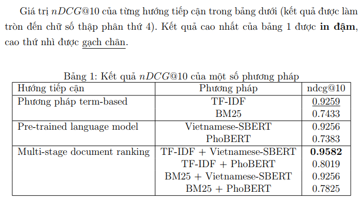

# Ad-hoc Document Retrieval for Vietnamese Newspapers

We present our implementation of a document search approach. We called it: "Ad-hoc Document Retrieval for Vietnamese Newspapers".

# What we did?

Our work: 

* Created a novel document search system that fuses traditional keyword matching with contextual understanding for superior retrieval (Multi-stage Document Ranking). Two corpora of 50,000+ Vietnamese news articles were collected via web crawling techniques for demonstration and evaluation purposes. 

* An experiment was conducted to compare the performance of different methods. Our results indicated that the combination of TF-IDF and Vietnamese-SBERT significantly outperformed competing approaches, attaining an $nDCG@10$ score of 95.82\% from our test set.

* Developed a web chatbot application with Flask and Bootstrap 5.0.

# Multi-stage Document Ranking

When we use a search engine like Google, we input a query and the system typically finds the best match by comparing keywords in the query to those in documents. Multi-stage document ranking  is enhanced by employing a pre-trained language model to convert queries and documents into embedding vectors, subsequently utilizing cosine similarity to identify the most relevant results.

Pipeline of our method:



Given a query and a large corpus of Vietnamese news articles, we initially employ a term-based method (TF-IDF or BM25) to retrieve the top 50 most relevant documents. Subsequently, these documents are re-ranked using a pre-trained language model (PhoBERT, Vietnamese-SBERT).

# Corpus

An example of an e-newspaper's structure is shown below.


As illustrated, each e-newspaper typically contains seven key attributes: title, abstract, source, link, topic, posting time, and image link (the URL of the main image).

Approximately 50,000 news articles were extracted from five Vietnamese news sources (Lao Động, Dân Trí, VnExpress, VTC, and Đảng Cộng Sản) using BeautifulSoup. 49542 articles would be used for demonstration purposes (link: https://drive.google.com/file/d/15e2N3Vp6CBosQI7zq8U9Z3yyccFD0Apu/view?usp=drive_link) and 352 articles for evaluation using nDCG@10 ```.\Ronaldo.xlsx```.

# Preprocessing

For each news article in the corpus, the corresponding text data is a combination of the title and abstract. This data then undergoes four preprocessing steps:

* Lowercasing: Convert all letters to lowercase (Di sản → di sản)

* Word segmentation: Separate compound words into individual tokens (di sản → di_sản)

* Stopword removal: Eliminate common, non-informative words (e.g., "the," "a," "an")

* Special character removal: Replace or remove special characters (tp.hcm → tphcm)

The input query is also subjected to these four data preprocessing steps.

# Evaluation

We use the query: "Ronaldo giàu cỡ nào" for the experiment. We then labeled each article in the test set by a number from 0 to 4 via this rule:`

* 0: The article does not contain any content related to the query.

* 1: The article provides information that helps us identify related side topics (partial aspects of the main topics) of the query.

* 2: The article contains useful information that helps us identify content containing relevant aspects of the query's topics.

* 3: The article provides more specific information than level 2 (i.e., beyond the topic, it offers important information about a person, event, etc.), allowing for a partial explanation of the query.

* 4: The article contains crucial contexts that fully encompass or explain the information related to the query.

The result of different approachs was showed in the table below:



You can look for more details of our work in this [PDF]('./Ad-hoc Document Retrieval for Vietnamese Newspapers.pdf') 

# Demo

We developed a web application (localhost) utilizing Flask and the Bootstrap5 framework to deploy the proposed model into a real-world application.

You could clone this repo to try it yourself.

# Acknowledgement and citation

We would like to acknowledge the significant contributions of these works to our project. These were the sources we consulted for our research: 

[1]. PhoBERT: Pre-trained language models for Vietnamese - https://aclanthology.org/2020.findings-emnlp.92.pdf

[2]. BERT: Pre-training of Deep Bidirectional Transformers for Language Understanding - https://arxiv.org/pdf/1810.04805.pdf

[3]. Improvements to BM25 and Language Models Examined - https://www.cs.otago.ac.nz/homepages/andrew/papers/2014-2.pdf

[4]. Rank-BM25: A two line search engine - https://pypi.org/project/rank-bm25/

[5]. IR-BERT: Leveraging BERT for Semantic Search in Background Linking for News Articles - https://arxiv.org/abs/2007.12603

[6]. Ad-hoc retrieval with BERT - https://arxiv.org/abs/2007.12603

[7]. Vietnamese-SBERT - https://huggingface.co/keepitreal/vietnamese-sbert

[8]. TF-IDF là gì? - https://vi.wikipedia.org/wiki/Tf%E2%80%93idf

[9]. Thực thi TF-IDF - https://scikit-learn.org/stable/modules/generated/sklearn.feature_extraction.text.TfidfVectorizer.html
